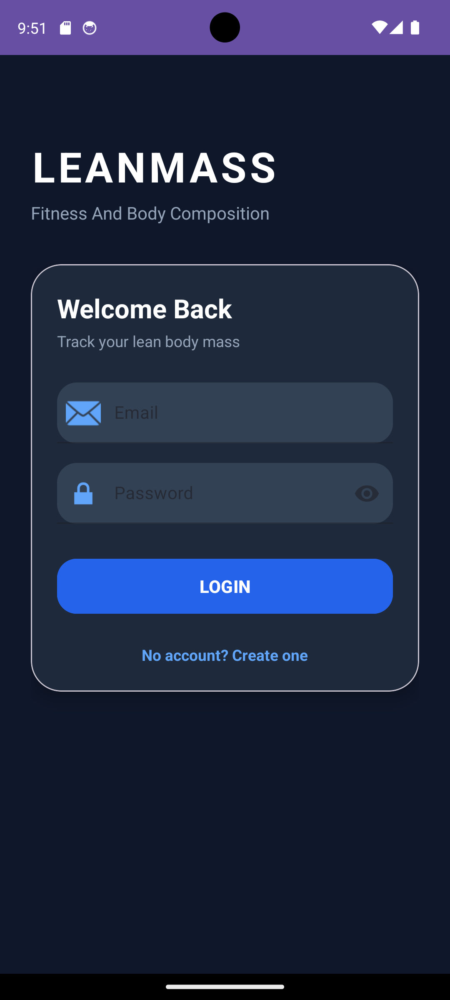
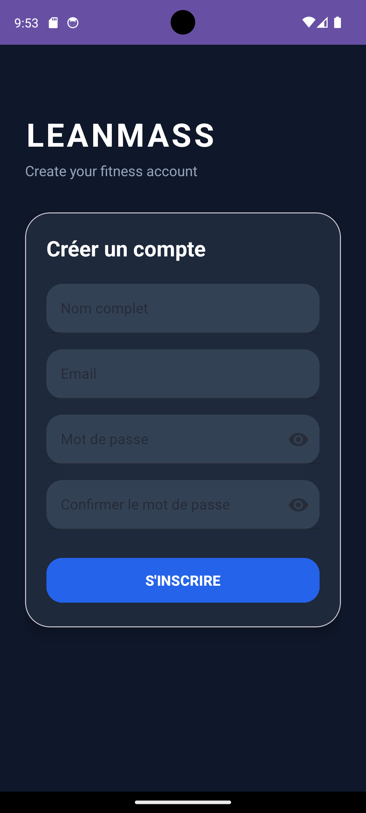
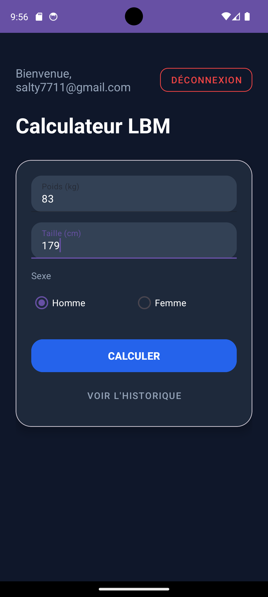
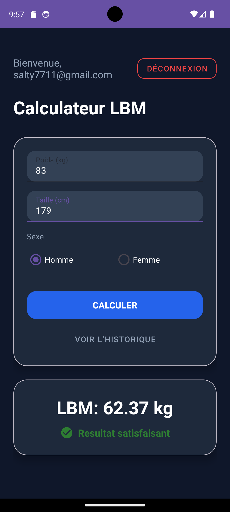
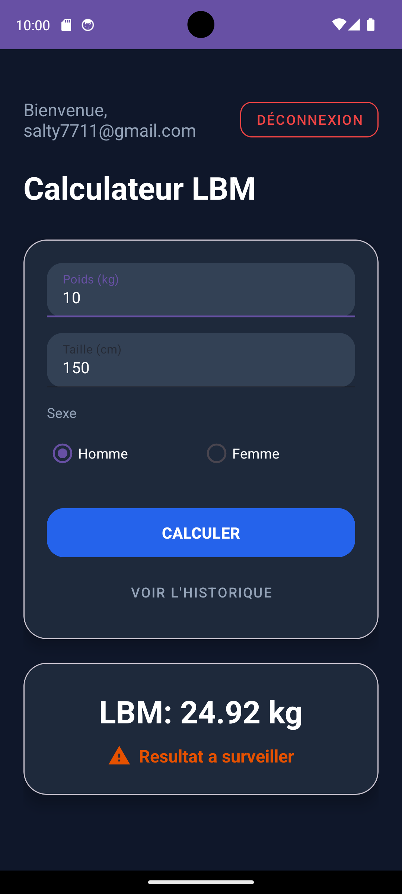
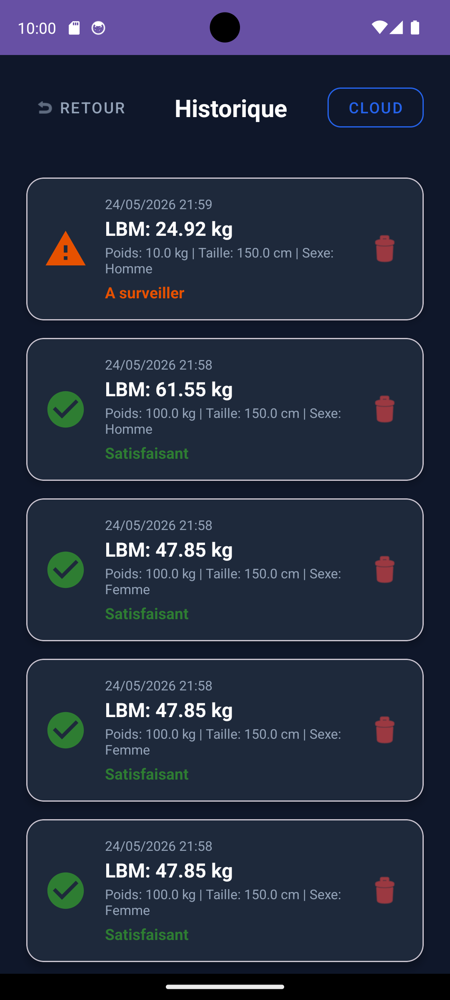

<div align="center">


### **Lean Body Mass Calculator**

`calculate. track. repeat.`

[](https://kotlinlang.org)
[](https://developer.android.com)
[](https://firebase.google.com)
[](https://www.sqlite.org)
[](LICENSE)

</div>

---

## `./about`

Android app that calculates your **Lean Body Mass** using the **Boer formula**, stores every calculation locally in SQLite AND in the cloud via Firebase Firestore, and lets you track your progress over time. Built with Kotlin, because Java is so 2016.

## `./features`

- **Authentication** — sign up / log in via Firebase Auth (email + password)
- **LBM Calculation** — Boer formula with gender-specific constants
- **Visual Feedback** — 🟢 satisfactory or 🟠 needs monitoring, based on configurable thresholds
- **Dual Persistence** — SQLite for offline + Firestore for cloud. why pick one when you can have both
- **Full History** — view, delete, switch between local/cloud data
- **Two UI approaches** — `findViewById` on auth screens, `ViewBinding` on calculator & history
- **Dark theme** — because light mode is a sysadmin's nightmare

## `./formula`

```
┌─────────────────────────────────────────────────────┐
│                  BOER FORMULA                       │
├─────────────────────────────────────────────────────┤
│                                                     │
│  Male:                                              │
│    LBM = (0.407 × W) + (0.267 × H) − 19.2         │
│    Threshold: ≥ 38 kg                               │
│                                                     │
│  Female:                                            │
│    LBM = (0.252 × W) + (0.473 × H) − 48.3         │
│    Threshold: ≥ 24 kg                               │
│                                                     │
│  W = weight (kg)  |  H = height (cm)               │
└─────────────────────────────────────────────────────┘
```

## `./architecture`

```
                    ┌──────────────┐
                    │  LoginActivity │◄─── LAUNCHER
                    │  (findViewById)│
                    └──────┬───────┘
                           │ sign in
                    ┌──────▼───────┐
                    │RegisterActivity│
                    │  (findViewById)│
                    └──────────────┘
                           │
                    ┌──────▼───────┐
                    │  MainActivity  │◄─── ViewBinding
                    │   Calculator   │
                    └──────┬───────┘
                           │
                    ┌──────▼───────┐
                    │ HistoryActivity│◄─── ViewBinding
                    │  + RecyclerView│
                    └──────────────┘
```

```
 ┌─────────┐     ┌──────────────┐     ┌───────────────┐
 │ LBMConfig│     │  Calculation  │     │     User      │
 │ (config) │     │   (model)     │     │   (model)     │
 └─────────┘     └──────┬───────┘     └───────────────┘
                        │
              ┌─────────┴──────────┐
              │                    │
      ┌───────▼────────┐  ┌───────▼────────┐
      │ DatabaseHelper  │  │ FirestoreHelper │
      │   (SQLite)      │  │   (Cloud)       │
      └────────────────┘  └────────────────┘
           local              cloud
```

## `./project-structure`

```
app/src/main/
├── AndroidManifest.xml
├── java/com/leanmasscalculator/app/
│   ├── auth/
│   │   ├── LoginActivity.kt          # findViewById approach
│   │   └── RegisterActivity.kt       # findViewById approach
│   ├── calculator/
│   │   └── MainActivity.kt           # ViewBinding approach
│   ├── history/
│   │   ├── HistoryActivity.kt        # ViewBinding approach
│   │   └── HistoryAdapter.kt         # RecyclerView adapter
│   ├── db/
│   │   ├── DatabaseHelper.kt         # SQLite CRUD
│   │   └── FirestoreHelper.kt        # Firestore CRUD + callbacks
│   ├── model/
│   │   ├── Calculation.kt            # calculation data model
│   │   └── User.kt                   # user data model
│   └── utils/
│       └── LBMConfig.kt              # formula constants & thresholds
└── res/
    ├── layout/
    │   ├── activity_login.xml
    │   ├── activity_register.xml
    │   ├── activity_main.xml
    │   ├── activity_history.xml
    │   └── item_history.xml
    ├── drawable/
    │   ├── ic_check_circle.xml        # green ✓
    │   └── ic_warning.xml             # orange ⚠
    └── values/
        ├── colors.xml
        ├── strings.xml
        └── themes.xml
```

## `./setup`

### prerequisites

- Android Studio (Panda | 2024+ recommended)
- JDK 17
- Android SDK 34
- A Firebase project (see below)

### firebase setup

```bash
# 1. go to https://console.firebase.google.com
# 2. create a new project
# 3. add an Android app with your package name
# 4. download google-services.json → place in app/
# 5. enable Authentication → Sign-in method: Email/Password
# 6. enable Cloud Firestore → start in test mode
# 7. (optional) create composite index for queries:
#    collection: calculations | fields: userId ASC, timestamp DESC
```

### build & run

```bash
# clone it
git clone https://github.com/YOUR_USERNAME/LeanMassCalculator.git
cd LeanMassCalculator

# open in android studio, or build from terminal:
./gradlew assembleDebug

# install on connected device/emulator
adb install app/build/outputs/apk/debug/app-debug.apk
```

## `./tech-stack`

| layer | tech |
|-------|------|
| language | Kotlin |
| min SDK | 24 (Android 7.0) |
| target SDK | 34 (Android 14) |
| UI | Material Design 3 |
| auth | Firebase Authentication |
| local DB | SQLite via `SQLiteOpenHelper` |
| cloud DB | Firebase Firestore |
| list rendering | `RecyclerView` + custom `Adapter` |
| view binding | `findViewById` + `ViewBinding` |
| build | Gradle (Groovy DSL) |

## `./screenshots`

<div align="center">

| Login | Register | Calculator |
|:---:|:---:|:---:|
|  |  |  |

| Result ✓ | Result ⚠ | History |
|:---:|:---:|:---:|
|  |  |  |

</div>

## `./license`

```
MIT License — do whatever you want with it.
just don't blame me if your LBM is unsatisfactory.
```

---

<div align="center">

`made with ☕ and kotlin`

</div>
